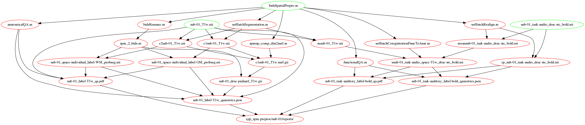

Quality control
***************

.. Note::

   The illustrations in this section mix what the files created by each workflow
   and the functions and are called by it.
   In this sense they are not pure DAGs (directed acyclic graphs)
   as the ``*.m`` files mentioned in them already exist.

- :func:`bidsQA`
- :func:`bidsQAbidspm`

.. _fig_spatialPrepro-reports:

   workflows for QA as part of the spatial preprocessing workflow

- :func:`anatQA`
- :func:`computeDesignEfficiency`
- :func:`plotEvents`
