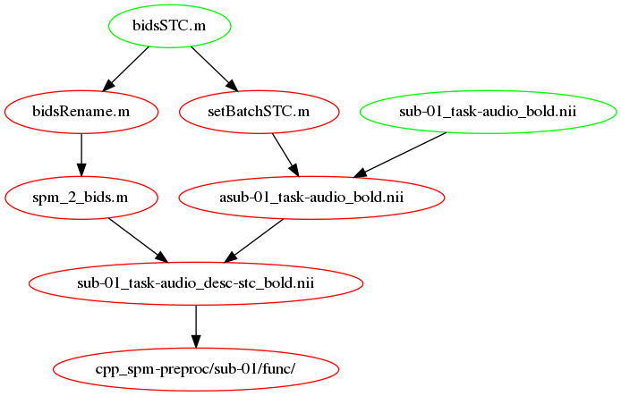
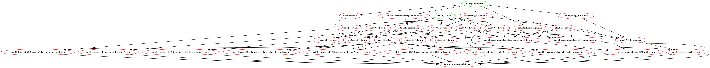
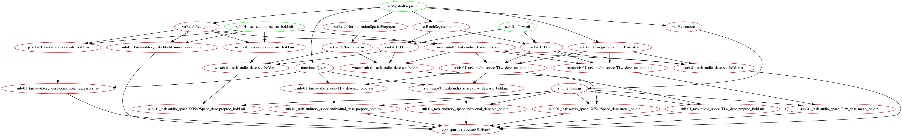
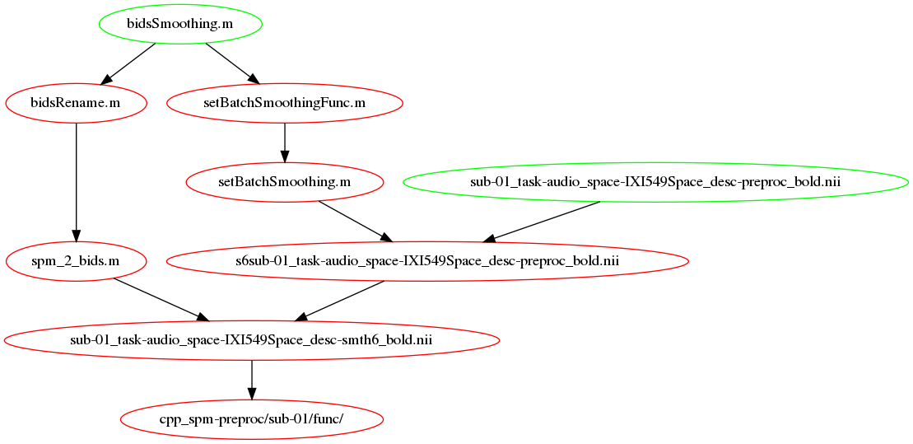
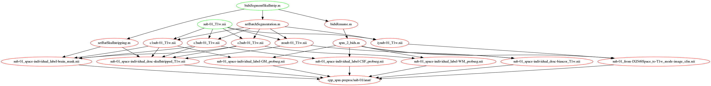

Preprocessing workflows
=======================

.. Note::

   The illustrations in this section mix what the files created by each workflow
   and the functions and are called by it.
   In this sense they are not pure DAGs (directed acyclic graphs) as the ``*.m`` files
   mentioned in them already exist.

Slice Time Correction
---------------------

:func:`bidsSTC`

More info available on this page of the
`SPM wikibook <https://en.wikibooks.org/wiki/SPM/Slice_Timing>`_.

.. _fig_stc:

   Slice timing correction workflow

Some comments from `here <http://mindhiveit.edu/node/109>`_ on STC, when
it should be applied

*At what point in the processing stream should you use it?*

*This is the great open question about slice timing, and it's not
super-answerable. Both SPM and AFNI recommend you do it before doing
realignment/motion correction, but it's not entirely clear why. The issue is
this:*

*If you do slice timing correction before realignment, you might look down your
non-realigned time course for a given voxel on the border of gray matter and
CSF, say, and see one TR where the head moved and the voxel sampled from CSF
instead of gray. This would results in an interpolation error for that voxel, as
it would attempt to interpolate part of that big giant signal into the previous
voxel. On the other hand, if you do realignment before slice timing correction,
you might shift a voxel or a set of voxels onto a different slice, and then
you'd apply the wrong amount of slice timing correction to them when you
corrected - you'd be shifting the signal as if it had come from slice 20, say,
when it actually came from slice 19, and shouldn't be shifted as much.*

*There's no way to avoid all the error (short of doing a four-dimensional
realignment process combining spatial and temporal correction - Remi's note:
fMRIprep does it), but I believe the current thinking is that doing slice timing
first minimizes your possible error. The set of voxels subject to such an
interpolation error is small, and the interpolation into another TR will also be
small and will only affect a few TRs in the time course. By contrast, if one
realigns first, many voxels in a slice could be affected at once, and their
whole time courses will be affected. I think that's why it makes sense to do
slice timing first. That said, here's some articles from the SPM e-mail list
that comment helpfully on this subject both ways, and there are even more if you
do a search for "slice timing AND before" in the archives of the list.*

Spatial Preprocessing
---------------------

Perform spatial preprocessing by running :func:`bidsSpatialPrepro`

The figures below show the ``bidsSpatialPrepro`` workflow as it would run using
realign and unwarp (default) and with normalization to SPM MNI space (``IXI549Space``).

.. _fig_spatialPrepro-anat:

   Anatomical component of the spatial preprocessing workflow

.. _fig_spatialPrepro-func:

   Functional component of the spatial preprocessing workflow

Smoothing
---------

Perform smoothing of the functional data by running
:func:`bidsSmoothing`

.. _fig_smoothing:

   Smoothing workflow

Others
------

:func:`bidsSegmentSkullStrip`

.. _fig_segmentSkullstrip:

   Segment and skullstrip workflow
