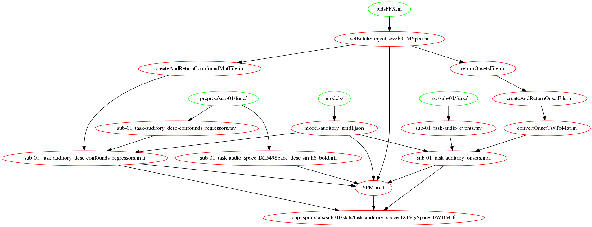

.. _statistics:

Statistics
**********

Statistics workflows
====================

.. automodule:: src.workflows.stats

Subject level
-------------

.. autofunction:: bidsFFX

.. _fig_FFX-specification:

   Subject level GLM specification workflow

.. autofunction:: bidsConcatBetaTmaps

Group level
-----------

.. autofunction:: bidsRFX

Compute results
---------------

.. autofunction:: bidsResults

Region of interest analysis
---------------------------

.. automodule:: src.workflows.roi

.. autofunction::  bidsCreateROI
.. autofunction::  bidsRoiBasedGLM

Statistics batches
==================

.. automodule:: src.batches.stats

Subject level
-------------

.. autofunction:: setBatchSubjectLevelGLMSpec
.. autofunction:: setBatchEstimateModel

Group level model
-----------------

.. autofunction:: setBatchContrasts
.. autofunction:: setBatchFactorialDesign
.. autofunction:: setBatchSubjectLevelContrasts
.. autofunction:: setBatchGroupLevelContrasts

Compute results
---------------

.. autofunction:: setBatchResults
.. autofunction:: setBatchSubjectLevelResults
.. autofunction:: setBatchGroupLevelResults

Statistics functions
====================

Subject level
-------------

.. automodule:: src.subject_level

.. autofunction:: createAndReturnOnsetFile
.. autofunction:: getFFXdir
.. autofunction:: getBoldFilenameForFFX
.. autofunction:: deleteResidualImages
.. autofunction:: specifyContrasts

Functions to deal with onsets files and confounds regressors.

.. autofunction:: convertOnsetTsvToMat
.. autofunction:: convertRealignParamToTsv
.. autofunction:: createAndReturnCounfoundMatFile
.. autofunction:: getConfoundsRegressorFilename
.. autofunction:: getRealignParamFilename

Group level model
-----------------

.. automodule:: src.group_level

.. autofunction:: getRFXdir

Compute results
---------------

.. automodule:: src.results

.. autofunction:: defaultOuputNameStruct
.. autofunction:: setMontage