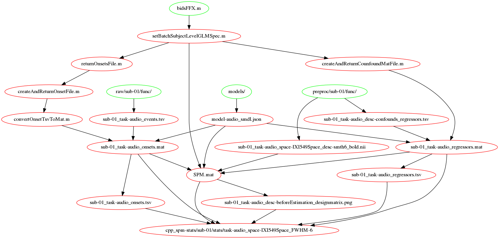
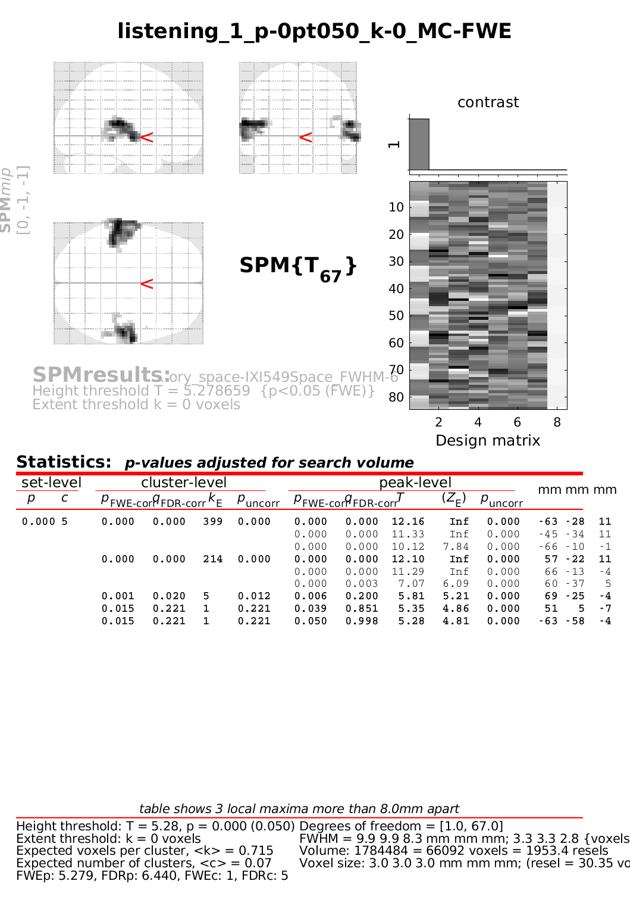
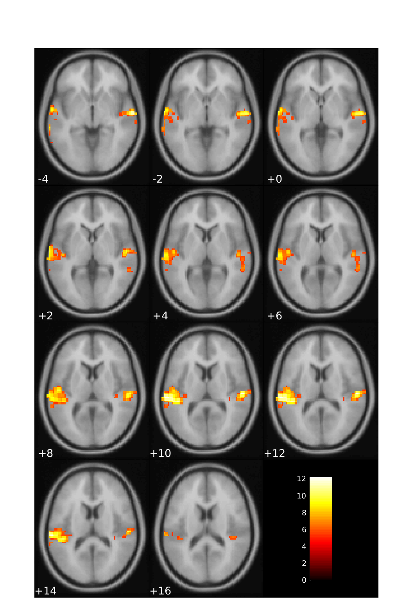
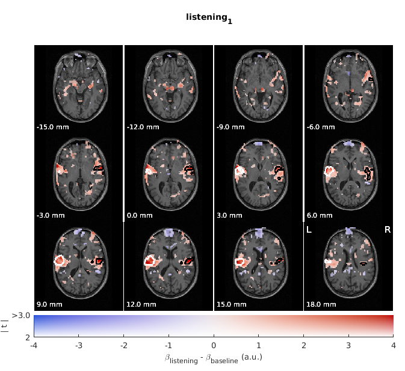

Make sure you are familiar with the :ref:`bids_stats_model`,
before you embark on to statistical analysis.

Statistics workflows
====================

.. Note::

   The illustrations in this section mix what the files created by each workflow
   and the functions and are called by it.
   In this sense they are not pure DAGs (directed acyclic graphs) as the ``*.m`` files
   mentioned in them already exist.

Subject level
-------------

:func:`bidsFFX`

After the specification step an output folder is created.
To get the fullpath of that folder you can use::

   getFFXdir(subLabel, opt)

A typical folder will contain::

   bidspm-stats/sub-01/stats/task-audio_space-IXI549Space_FWHM-6
   ├── SPM.mat
   ├── sub-01_task-audio_space-IXI549Space_desc-beforeEstimation_designmatrix.png
   ├── sub-01_task-audio_run-01_desc-confounds_regressors.mat
   ├── sub-01_task-audio_run-01_desc-confounds_regressors.tsv
   ├── sub-01_task-audio_run-01_onsets.mat
   └── sub-01_task-audio_run-01_onsets.tsv

Each run should have a pair of tsv/mat files:

- One that summarises the onsets used for that design.
- One that summarises the regressors confounds used for that design.

In most cases those are going to be a subset of the content:

- of the ``_events.tsv`` from the raw BIDS dataset
- of the ``_regressors.tsv`` from the deriratives BIDS dataset containing
  the preprocessed data.

What part of the _events.tsv and _regressors.tsv
gets into the final GLM specification
depends on the BIDS statistical model used.

The mat files can directly be ingested by SPM:
the TSV files are there for both logging and interoperability.

.. _fig_FFX-specification:

   Subject level GLM specification workflow for model specification

Compute results
---------------

:func:`bidsResults`

:download:`CSV output example <images/results_fig/output.csv>`

.. _MoAE_output_figure:

   Example of subject level results from the MoAE demo

.. _MoAE_montage_figure:

   Example of subject level montage from the MoAE demo

bidspm also includes the ``slice_display`` code that allows you to plot on the
same figure:

- beta values
- t values
- cluster boundaries
- ROI boundaries

An example of how to use it is available in the ``moae_04_slice_display.m``
script in the MoAE demo.

.. _MoAE_slice_display_figure:

   Example of subject level slice display from the MoAE demo
